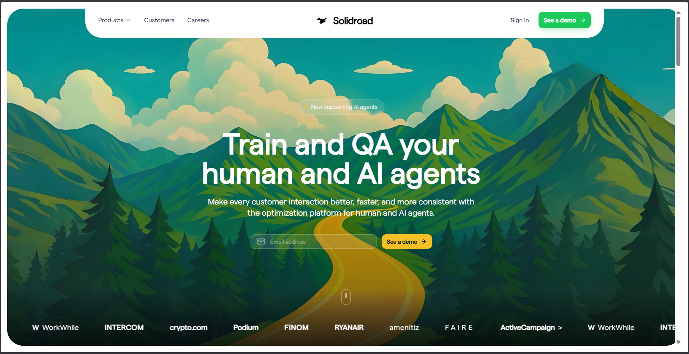
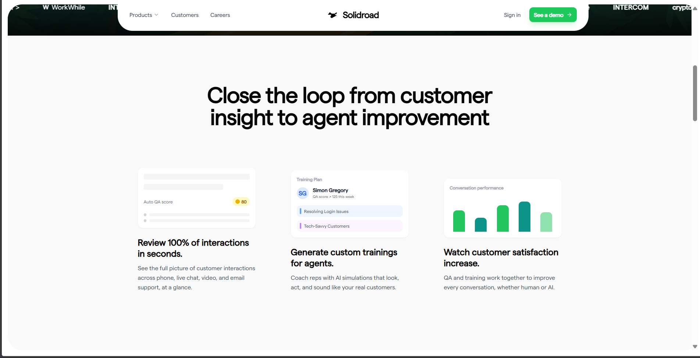
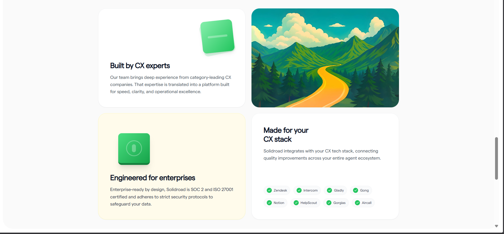
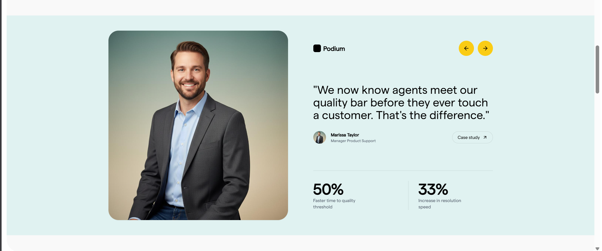
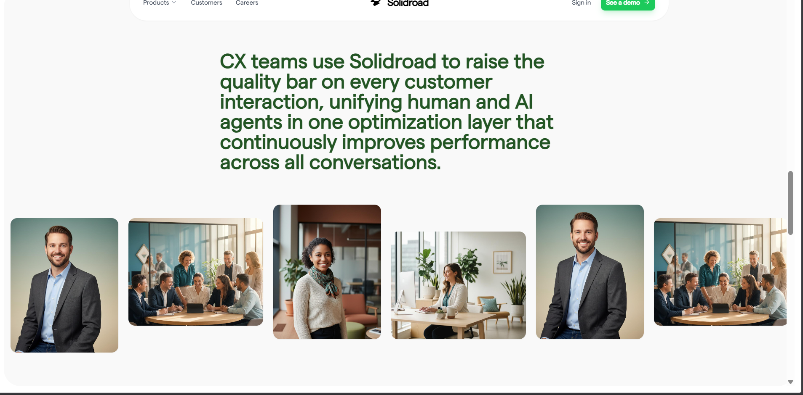

# Sparkable Frontend Assignment



This project is a modern, responsive SaaS landing page clone built with a robust technology stack. It features a sleek design with interactive components, smooth animations, and a fully functional layout.

## ✨ Features

- **Modern UI/UX**: clean, professional design with glassmorphism and gradient effects.
- **Responsive Layout**: Fully optimized for desktop, tablet, and mobile devices.
- **Interactive Components**:
  - **Logo Ticker**: Animated ticker for partner logos.
  - **Bento Grid**: Stylish grid layout for features or team members.
  - **Hero Section**: Dynamic hero area with gradient overlays.
- **High Performance**: Built with Vite for lightning-fast development and build times.
- **Type Safety**: Full TypeScript support for robust code quality.

## 🛠️ Tech Stack

- **Framework**: [React 19](https://react.dev/)
- **Language**: [TypeScript](https://www.typescriptlang.org/)
- **Build Tool**: [Vite](https://vitejs.dev/)
- **Styling**: [Tailwind CSS](https://tailwindcss.com/)
- **Routing**: [TanStack Router](https://tanstack.com/router)
- **UI Library**: [Radix UI](https://www.radix-ui.com/)
- **Icons**: [Lucide React](https://lucide.dev/)

## 🚀 Getting Started

Follow these steps to set up the project locally.

### Prerequisites

Ensure you have the following installed:

- [Node.js](https://nodejs.org/) (v18 or higher recommended)
- npm (comes with Node.js)

### Installation

1.  **Clone the repository:**

    ```bash
    git clone <repository-url>
    cd app
    ```

2.  **Install dependencies:**
    ```bash
    npm install
    ```

### Running the Project

Start the development server:

```bash
npm run dev
```

Open your browser and navigate to `http://localhost:5173` (or the port shown in your terminal).

## 📸 Screenshots

### Hero Section


### Key Features



### Grid View



### People



### Additional Views



## 📂 Project Structure

```bash
src/
├── assets/         # Static assets
├── components/     # Reusable UI components
├── routes/         # Application routes (TanStack Router)
├── sections/       # Page sections (Hero, Features, etc.)
├── App.tsx         # Main application component
└── main.tsx        # Entry point
```

## 🤝 Contributing

Contributions are welcome! Please feel free to submit a Pull Request.

---

Built with ❤️ using React and Vite.
